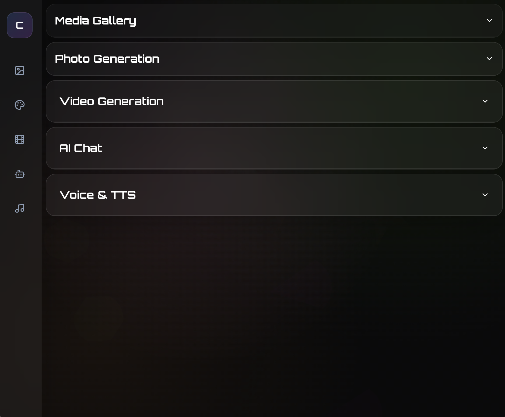

<div align="center">

# 🎨 ConCreat



**A cutting-edge web application for creating and managing multimedia content with integrated AI-powered capabilities**

[](https://github.com/kliewerdaniel/concreat)
[](https://opensource.org/licenses/MIT)
[](https://nextjs.org/)
[](https://reactjs.org/)
[](https://www.typescriptlang.org/)
[](https://www.python.org/)

[🚀 Live Demo](https://concreat.vercel.app) • [📖 Documentation](#-documentation) • [🐛 Report Bug](https://github.com/kliewerdaniel/concreat/issues) • [✨ Request Feature](https://github.com/kliewerdaniel/concreat/issues)

</div>

---

## 📋 Table of Contents

- [✨ Features](#-features)
- [🤖 ComfyUI Integration](#-comfyui-integration)
- [⚡ Quick Start](#-quick-start)
- [🔧 Manual Setup](#-manual-setup)
- [📂 Project Architecture](#-project-architecture)
- [🔌 API Reference](#-api-reference)
- [🔐 Environment Configuration](#-environment-configuration)
- [🛠️ Development Workflow](#️-development-workflow)
- [🤝 Contributing](#-contributing)
- [📄 License](#-license)
- [🛠️ Technology Stack](#️-technology-stack)
- [🙏 Acknowledgments](#-acknowledgments)

---

## ✨ Features

<div align="center">

### 🎯 Core Capabilities

| Feature | Description |
|---------|-------------|
| 🎨 **AI Image Generation** | Create stunning images using ComfyUI workflows with GGUF models |
| 🎬 **Video Processing** | Advanced video generation and processing with HunyuanVideo integration |
| 🗣️ **Text-to-Speech** | Natural voice synthesis powered by Chatterbox technology |
| 🎵 **Voice Cloning** | Personalize audio content with advanced voice replication |
| 📱 **Modern UI/UX** | Sleek interface built with Next.js, React, and Tailwind CSS |
| 🔗 **ComfyUI Integration** | Node-based AI workflows for professional content creation |

### 🚀 Advanced Features

- **GGUF Model Support** - Optimized quantized models for efficient inference
- **Customizable Pipelines** - Node-based workflows that can be modified and extended
- **High-Quality Output** - Support for various formats with configurable quality settings
- **Prompt Engineering** - Advanced text encoding with positive/negative prompts
- **Real-time Processing** - Fast generation with optimized model architectures
- **Cross-platform Compatibility** - Works on Windows, macOS, and Linux

</div>

---

## 🤖 ComfyUI Integration

ConCreat leverages **[ComfyUI](https://github.com/comfyanonymous/ComfyUI)**, a powerful node-based interface for AI image and video generation, to provide advanced creative tools.

### 📋 Included Workflows

#### 🎨 Image Generation Workflow (`workflows/imagemaker.json`)
Advanced image creation using GGUF models like z_image_turbo, with support for LoRA models and custom prompts

#### 🎬 Video Generation Workflow (`workflows/video.json`)
Video creation using HunyuanVideo15 models for high-quality video generation from images

### 🔧 Workflow Features

- **⚡ GGUF Model Support**: Optimized quantized models for efficient inference
- **🔄 Customizable Pipelines**: Node-based workflows that can be modified and extended
- **🎯 High-Quality Output**: Support for various image and video formats with configurable quality settings
- **💬 Prompt Engineering**: Advanced text encoding with positive and negative prompts

### 📥 ComfyUI Model Requirements

To use the included ComfyUI workflows, you'll need to download the following models and place them in your ComfyUI models directory:

#### 🎨 Required Models for Image Generation

| Model | Filename | Download Link | Location |
|-------|----------|---------------|----------|
| **VAE** | `ae.safetensors` | [Hugging Face](https://huggingface.co/stabilityai/sd-vae-ft-mse-original/blob/main/vae-ft-mse-840000-ema-pruned.safetensors) | `ComfyUI/models/vae/` |
| **CLIP** | `Qwen3-4B-UD-Q6_K_XL.gguf` | [Hugging Face](https://huggingface.co/ggml-org/Qwen2.5-3B-Instruct-Q6_K_L.gguf) | `ComfyUI/models/clip/` |
| **Unet** | `z_image_turbo-Q8_0.gguf` | [Hugging Face](https://huggingface.co/city96/FLUX.1-dev-gguf/blob/main/flux1-dev-Q8_0.gguf) | `ComfyUI/models/unet/` |

#### 🎬 Required Models for Video Generation

| Model | Filename | Download Link | Location |
|-------|----------|---------------|----------|
| **Checkpoint** | `HV15-Rapid-AIO-v1.safetensors` | [Hugging Face](https://huggingface.co/Tencent-Hunyuan/HunyuanVideo/blob/main/HV15-Rapid-AIO-v1.safetensors) | `ComfyUI/models/checkpoints/` |
| **CLIP Vision** | `sigclip_vision_patch14_384.safetensors` | [Hugging Face](https://huggingface.co/google/siglip-so400m-patch14-384/blob/main/sigclip_vision_patch14_384.safetensors) | `ComfyUI/models/clip_vision/` |

#### 🛠️ ComfyUI Installation

```bash
# Clone ComfyUI repository
git clone https://github.com/comfyanonymous/ComfyUI.git
cd ComfyUI

# Install dependencies
pip install -r requirements.txt

# Download required custom nodes
# ComfyUI-GGUF: https://github.com/city96/ComfyUI-GGUF
# rgthree-comfy: https://github.com/rgthree/rgthree-comfy
```

> **💡 Note**: Model file sizes can be large (several GB). Ensure you have sufficient disk space and a stable internet connection for downloads.

---

## ⚡ Quick Start

### 📋 System Requirements

- **Node.js**: Version 18 or higher
- **Python**: Version 3.11 or above
- **Git**: For version control
- **Storage**: At least 10GB free space for models

### 🚀 Automated Installation

1. **Clone the Repository**
   ```bash
   git clone https://github.com/kliewerdaniel/concreat.git
   cd ConCreat
   ```

2. **Execute Setup Script**
   ```bash
   npm run setup
   ```
   This command handles all dependency installations and creates the Python virtual environment automatically.

3. **Launch Development Server**
   ```bash
   npm run dev
   ```

4. **Access Application**
   Open your browser and navigate to [http://localhost:3000](http://localhost:3000)

---

## 🔧 Manual Setup

For those preferring step-by-step installation:

### 📦 Frontend Dependencies
```bash
npm install
```

### 🐍 Python Environment Setup
```bash
python3 -m venv venv
source venv/bin/activate  # Use `venv\Scripts\activate` on Windows
```

### 📚 Python Dependencies
```bash
pip install -r requirements.txt
```

### ▶️ Application Launch
```bash
npm run dev
```

---

## 📂 Project Architecture

```
ConCreat/
├── 📁 src/app/
│   ├── 📁 api/
│   │   ├── 📁 chat/          # 💬 Chat system endpoints
│   │   ├── 📁 generate/      # 🎨 Content creation APIs
│   │   ├── 📁 images/        # 🖼️ Image manipulation APIs
│   │   ├── 📁 tts/           # 🗣️ Text-to-speech conversion
│   │   ├── 📁 videos/        # 🎬 Video processing endpoints
│   │   └── 📁 voices/        # 🎵 Voice management system
│   ├── 🎨 globals.css        # Global stylesheet
│   ├── 📱 layout.tsx         # Application layout component
│   └── 🏠 page.tsx           # Main page component
├── 🌐 public/                # Static resources
├── 🔧 workflows/             # Workflow configuration files
├── 🐍 tts_service.py         # Python TTS service implementation
├── ⚙️ setup.sh               # Automated setup script
├── 📋 requirements.txt       # Python package requirements
├── 📦 package.json           # Node.js project configuration
└── 📖 README.md              # Project documentation
```

> **📝 Note**: The `chatterbox/` directory containing TTS models is generated during setup and not part of the repository.

---

## 🔌 API Reference

| Endpoint | Method | Description |
|----------|--------|-------------|
| `/api/chat` | GET/POST | 💬 Interactive chat functionality |
| `/api/generate` | POST | 🎨 AI content generation services |
| `/api/images` | GET/POST | 🖼️ Image processing and management |
| `/api/tts` | POST | 🗣️ Text-to-speech conversion endpoint |
| `/api/videos` | GET/POST | 🎬 Video content operations |
| `/api/voices` | GET/POST | 🎵 Voice cloning and management |

---

## 🔐 Environment Configuration

Create a `.env.local` file in the project root:

```bash
# Optional: Hugging Face authentication token for model access
HF_TOKEN=your_huggingface_token_here

# Optional: OpenAI API key for enhanced features
OPENAI_API_KEY=your_openai_api_key_here
```

---

## 🛠️ Development Workflow

### 🏃‍♂️ Available Commands

| Command | Description |
|---------|-------------|
| `npm run dev` | 🚀 Start development server |
| `npm run build` | 🔨 Create production build |
| `npm run start` | ▶️ Start production server |
| `npm run lint` | 🔍 Run ESLint code quality checks |
| `npm run setup` | ⚙️ Complete environment setup |

### ✨ Quality Assurance

The project maintains high code standards with:
- **🔍 ESLint**: JavaScript/TypeScript code quality enforcement
- **📝 TypeScript**: Enhanced type safety and developer experience
- **🎨 Tailwind CSS**: Consistent and responsive styling

---

## 🤝 Contributing

We ❤️ contributions! Please follow these steps:

### 📝 How to Contribute

1. **🍴 Fork** the repository
2. **🌿 Create** a feature branch: `git checkout -b feature/amazing-feature`
3. **💻 Make** your changes and commit: `git commit -am 'Add amazing feature'`
4. **📤 Push** your changes: `git push origin feature/amazing-feature`
5. **🔄 Open** a Pull Request

### 🐛 Bug Reports & Feature Requests

- **🐛 Bug Reports**: [Create an issue](https://github.com/kliewerdaniel/concreat/issues) with the bug label
- **✨ Feature Requests**: [Create an issue](https://github.com/kliewerdaniel/concreat/issues) with the enhancement label
- **💬 Questions**: Join our [Discord community](#)

### 📋 Development Guidelines

- Follow the existing code style
- Write clear, concise commit messages
- Update documentation as needed
- Add tests for new features
- Ensure all tests pass

---

## 📄 License

This project is licensed under the **MIT License** - see the [LICENSE](LICENSE) file for details.

[](https://opensource.org/licenses/MIT)

---

## 🛠️ Technology Stack

<div align="center">

### 🎨 Frontend


### 🖥️ Backend & AI


### ☁️ Deployment & Tools


</div>

---

## 🙏 Acknowledgments

- **[ComfyUI](https://github.com/comfyanonymous/ComfyUI)** - Powerful node-based AI interface
- **[Chatterbox](https://github.com/fpjohnston/chatterbox)** - Advanced TTS technology
- **[HunyuanVideo](https://github.com/Tencent/HunyuanVideo)** - High-quality video generation models
- **[Next.js](https://nextjs.org/)** - The React framework for production
- **[Tailwind CSS](https://tailwindcss.com/)** - A utility-first CSS framework

---

<div align="center">

**Made with ❤️ by [Daniel Kliewer](https://github.com/kliewerdaniel)**

⭐ **Star this repo** if you found it helpful!

[⬆️ Back to Top](#-concreat)

</div>
